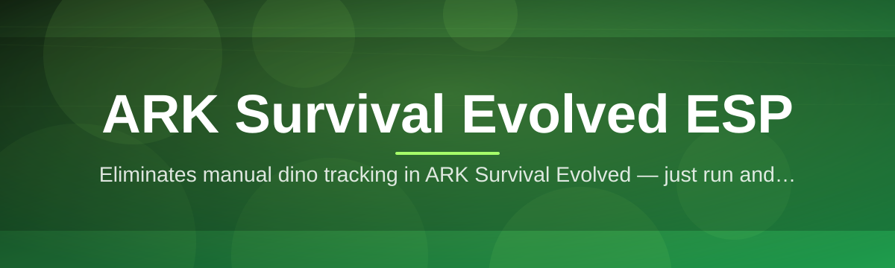
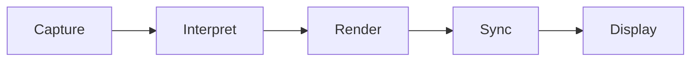

# ark-survival-evolved-overlay 🦖🗺️

  

*A calm, glass-clear overlay that turns the fog of the Island into a readable map.*

  

## 🧭 Overview

The Island is enormous, and most of it is invisible until it kills you. `ark-survival-evolved-overlay` is a lightweight desktop overlay for **ARK: Survival Evolved** that renders tribe-relevant information — dinosaur positions, resource nodes, player markers, structure outlines — directly over your game window, without touching game files or memory in a way that alters gameplay. Think of it as a second pair of glasses: the world looks the same, you just stop squinting.

This project exists because ARK's own UI was built for controllers and console menus, not for tribes coordinating raids, breeding lines, or base defense across thousands of in-game meters. An **ESP-style overlay** (Extra-Sensory Perception, in the classic HUD-tooling sense) fills that gap — it's the same idea behind minimap tools in other survival games, adapted to ARK's particular blend of dinosaurs, tribes, and terrain.

It's built for solo survivors who are tired of walking into a Rex nest blind, and for tribe leads who need a shared spatial picture during a base defense at 2 AM server time. If you've ever alt-tabbed to a wiki map mid-fight, this tool is the fix.

> [!NOTE]
> This overlay reads and displays information. It does not modify game memory, inject code into the ARK process, or alter server-side state. It is a rendering layer, nothing more.

---

## 🔭 What It Actually Shows You

Each capability below answers a different survival question — not just "what's here" but "why does it matter at 3 AM on a PvP server."

| Capability | What It Solves |
|---|---|
| **Living Radar** | A rotating, zoomable minimap that tracks nearby creatures by threat tier, so you stop mistaking a Therizino for a Stego. |
| **Resource Painter** | Highlights metal, crystal, and berry clusters within render distance — no more running the same barren loop twice. |
| **Tribe Pulse** | Shows tribemate positions and status in real time, turning a scattered group into a coordinated one. |
| **Threat Ring** | A configurable danger radius around aggressive dinos, color-coded by aggro range, not just distance. |
| **Structure Skeleton** | Outlines foundations, walls, and turrets through fog or foliage, useful for planning raids on your own base defenses. |
| **Loot Beacon** | Flags nearby drops, supply crates, and beacons before they despawn. |
| **Session Timer** | Tracks taming progress, imprint windows, and egg incubation without a second monitor. |
| **Overlay Themes** | Switch between a minimal HUD and a dense tactical layout depending on whether you're exploring or defending. |

> [!TIP]
> Start with the **Living Radar** and **Threat Ring** alone. Most players find that pairing is 80% of what they actually needed — the rest is seasoning.

---

## ⛺ Getting Started

1. Visit the landing page via the download button above.

2. Download the standalone package — no installer wizard, no bundled extras.

3. Launch ARK: Survival Evolved first, then start the overlay.

4. Adjust opacity and layout in the settings panel until it disappears into your peripheral vision.

> [!IMPORTANT]
> Run the overlay with the same privilege level as the game client. Mismatched permission levels are the #1 cause of "nothing is rendering" reports.

---

## 🖥️ System Requirements

| Component | Requirement |
|---|---|
| OS | Windows 10 (64-bit) or Windows 11 |
| Game | ARK: Survival Evolved, any distribution |
| Dependencies | None — fully standalone binary |
| GPU | Anything from the last decade with a DirectX 11 driver |
| Storage | Under 200 MB |
| Network | Not required after download |

---

## ⚙️ How It Works

The overlay operates as a compositor sitting *above* the game window, not inside its process space. Broadly:

1. **Capture** — the overlay reads the game window's position and dimensions.

2. **Interpret** — a lightweight parser translates visible world data into overlay coordinates.

3. **Render** — a transparent DirectX layer draws markers, rings, and labels in real time.

4. **Sync** — the render loop re-aligns every frame so markers never drift from what they describe.

5. **Display** — the composited result sits on top of ARK, invisible to screen capture unless you opt in.

> [!WARNING]
> Multi-monitor setups with mixed DPI scaling can cause marker offset. Set all displays to matching scale factors before reporting a rendering bug.

---

## 🧩 Troubleshooting

<strong>The overlay window is transparent but shows nothing.</strong>

Confirm ARK is running in Windowed or Borderless mode. True Fullscreen Exclusive mode blocks overlay compositing at the OS level — this is a Windows limitation, not a bug in this tool.

<strong>Markers are drawn in the wrong position.</strong>

Recalibrate via the settings panel's "Realign" option. This usually happens after changing resolution mid-session.

<strong>The overlay disappeared after an ARK update.</strong>

Game updates occasionally shift internal structures the parser depends on. Check the landing page for a compatibility note — updates typically follow within days of a major ARK patch.

<strong>My frame rate dropped after launching the overlay.</strong>

Try the Minimal theme under UI settings. The dense tactical layout renders more elements per frame and costs more on older GPUs.

<strong>Can I use this on unofficial or modded servers?</strong>

Compatibility varies by mod set. Heavily modified maps may not render correctly since the parser expects vanilla-shaped world data.

<strong>Is this detectable by anti-cheat systems?</strong>

The overlay does not modify game memory or inject code. That said, always check the current ruleset of the server you play on — some communities restrict overlay tools regardless of technical method.

---

## 🎨 UI & UX Details

  

Default keyboard shortcuts:

| Key | Action |
|---|---|
| `F1` | Toggle overlay visibility |
| `F2` | Cycle theme (Minimal / Tactical / Night) |
| `F3` | Toggle Threat Ring |
| `F4` | Toggle Resource Painter |
| `F5` | Open settings panel |
| `Ctrl+F1` | Reset overlay position |

Three built-in themes ship out of the box:

- **Minimal** — thin outlines, low opacity, built for exploration.

- **Tactical** — dense markers, full labels, built for raids and defense.

- **Night** — dimmed palette matched to ARK's in-game night cycle, easier on the eyes during long sessions.

All settings persist locally in a config file — nothing is uploaded, nothing phones home.

---

## 🤝 Contributing & Community

> [!TIP]
> New contributors: start with issues tagged `good-first-issue`. They're scoped to be finished in an evening, not a weekend.

Contributions are welcome in the form of bug reports, theme submissions, translation help, and parser improvements following ARK updates. Before opening a pull request:

- Search open issues for duplicates.

- Describe your ARK version and Windows build in bug reports.

- Keep pull requests focused — one fix or feature per PR.

Community discussion happens in the repository's Issues and Discussions tabs. Be specific, be kind, and include screenshots when reporting rendering issues — a picture of a misplaced marker is worth a thousand words of description.

---

## 📜 License

Released under the [MIT License](LICENSE), 2026. Use it, fork it, learn from it — just carry the license forward.

---

## ⚠️ Disclaimer

This project is an independent, community-built overlay tool and is not affiliated with, endorsed by, or associated with Studio Wildcard, Instinct Games, or the official ARK: Survival Evolved development team. It is provided "as is," without warranty of any kind. Use on any given server is subject to that server's own rules — always check before playing. Names of games and companies referenced belong to their respective owners.

